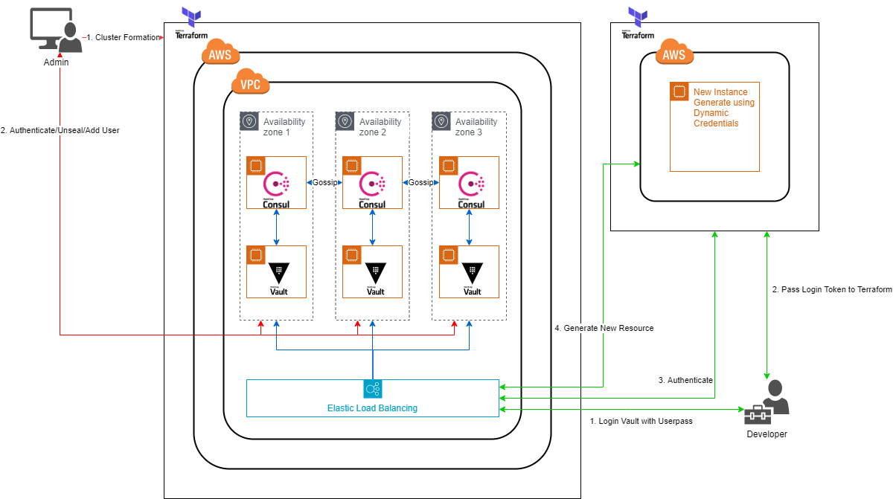

# Securitas
A Dynamic and Infra-scaling secrets manager.  Scalable system with secrets manager built into the core of the system combining secrets manager, aws secrets engine and identity authentication to provide role-based access with granular permission to generate new resource on cloud to developers in an organization.

## Securitas Architecture

## Getting Started

There are 2 different personals involved in this guide, the "Administrator" and the "Developer". 

**Administrator**

The "Administrator" is the operator responsible for launching, configuring, and managing Vault using Terraform. They configure [AWS Secrets Engine](https://www.vaultproject.io/docs/secrets/aws/index.html) in Vault and defining the policy scope for the AWS credentials dynamically generated. They generate new user in system with their varying capacity of usage.

The "Administrator" is generally concerned about managing the static and long lived AWS IAM credentials with varying scope required for developers to provision infrastructure in AWS.

Things to follow as administrator:

* Vault_cluster folder - for deployment of cluster and managing it. (Follow Readme under the folder)
* admin_workspace - for managing the admin workspace. (Follow Readme under the folder)

**Developer**

The "Developer" is the developer looking to safely provision infrastructure using Terraform without having to worry about managing sensitive AWS credentials locally.

Things to follow as developer:

* Developer-workspace - for developer usage (Follow Readme under the folder)

## Built With

* Packer - Used to build AMIs on AWS
* Terraform - Used to provision the infrastructure
* Vault - Secrets & identity management
* Consul - Resilient backend/storage for vault
