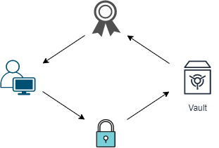
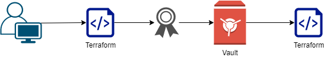
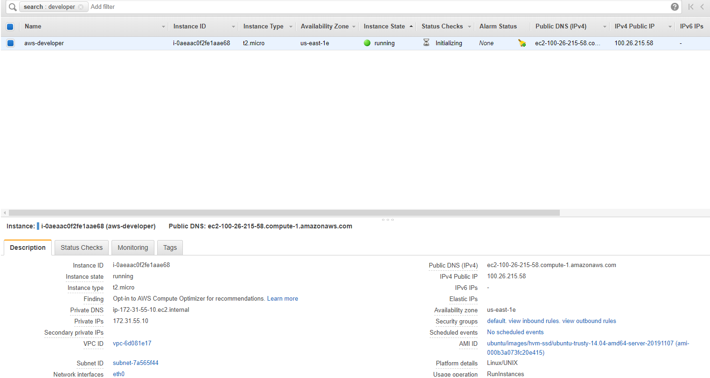

# Developer Workspace

The Developer is looking to safely provision infrastructure using Terraform without having to worry about managing sensitive AWS credentials locally.

**Developer Vault Login Workflow:**

The login generates the developer token which is validate for certain duration depending how administrator has setup developer role. By default in this sample it is 8hr.




**Terraform Dynamic credential workflow:**





## Inputs

Provided by Administrator:

| Name          | Description                                       | Type     | Required |
| ------------- | ------------------------------------------------- | -------- | -------- |
| vault_address | Elastic Load Balancer address of  Vault Cluster   | `string` | yes      |
| aws_backend   | AWS Secret Engine in vault under path aws backend | `string` | yes      |
| aws_role      | AWS Secret Engine in vault with aws role          | `string` | yes      |

Generated by Developer:

| Name            | Description                                                  | Type     | Required |
| --------------- | ------------------------------------------------------------ | -------- | -------- |
| developer_token | Developer vault token which has permission to request AWS credentials from the AWS backend | `string` | yes      |
| name            | ec2 provision Name tag value                                 | `string` | no       |
| ttl             | ec2 provision TTL tag value                                  | `string` | no       |

## Usage

If using Terraform Open Source, execute the following commands:

Request:

```bash
>export VAULT_ADDR=<your_vault_server_address>
>vault login -tls-skip-verify -method=userpass username=<your_vault_username> password=<your_vault_password>
```

Response:

```bash
Success! You are now authenticated. The token information displayed below
is already stored in the token helper. You do NOT need to run "vault login"
again. Future Vault requests will automatically use this token.

WARNING! The following warnings were returned from Vault:

  * TTL of "768h" exceeded the effective max_ttl of "8h"; TTL value is capped
  accordingly

Key                    Value
---                    -----
token                  <your newly generated developer_token value>
token_accessor         <some token value>
token_duration         8h
token_renewable        true
token_policies         ["default" "developers"]
identity_policies      []
policies               ["default" "developers"]
token_meta_username    <your_vault_username>
```

Request:

```bash
>terraform init
>terraform plan
>terraform apply
```

## Result



## Author

Managed by [Aditya Munot](https://github.com/AdityaMunot)

